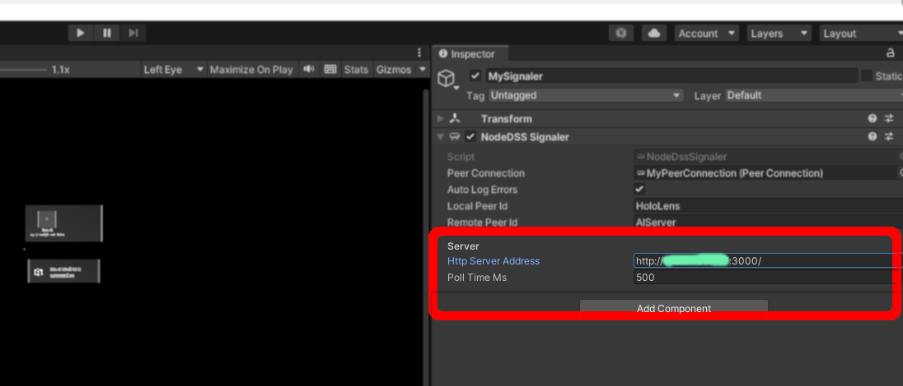

<h1 align="center">
  <br>
  <div align="center">
  <a href="https://jotrockenmitlocken.de"></a>
  <br>
  Hololens-SmartAR
  <br>
  </div>
  <!-- <br>
  <a href="https://jotrockenmitlocken.de"></a>
  <br> -->
</h1>

<!-- <h1 align="center">
  <br>
  <a href="https://jotrockenmitlocken.de"></a>
  <a href="https://jotrockenmitlocken.de"></a>
  <a href="https://jotrockenmitlocken.de"></a>
</h1> -->

<div align="center">
<h4 align="center">Designing User-adaptive Guidance for Mixed Reality Using Eye-Tracking <a href="https://jotrockenmitlocken.de" target="_blank"></a></h4>
</div>
<!-- [](https://github.com/Kataglyphis/GraphicsEngineVulkan/actions/workflows/Linux.yml)
[](https://github.com/Kataglyphis/GraphicsEngineVulkan/actions/workflows/Windows.yml)
[]() -->
<!-- [](https://www.paypal.com/donate/?hosted_button_id=BX9AVVES2P9LN) -->
<!-- [](https://twitter.com/Cataglyphis_) -->

> **_NOTE:_** Due to Git LFS storage limitations on github all model .onnx files + weights are stored separately. In order to run the project you might have to manually copy them into the folder 
"AIServer/AIServer/Assets/" (follow this link: https://drive.google.com/drive/folders/1lC2jHfe08Jcu86ueu86ThJXM0lPFQAZU?usp=sharing)<br />

<div align="center">
<p align="center">
  <a href="#key-features">Key Features</a> •
  <a href="#how-to-use">How To Use</a> •
  <a href="#download">Download</a> •
  <a href="#credits">Credits</a> •
  <a href="#related">Related</a> •
  <a href="#license">License</a>
</p>
</div>

<!-- TABLE OF CONTENTS -->
<details open="open">
  <summary>Table of Contents</summary>
  <ol>
    <li>
      <a href="#about-the-project">About The Project</a>
      <ul>
        <li><a href="#built-with">Built With</a></li>
      </ul>
	  <ul>
        <li><a href="#useful-tools">Useful tools</a></li>
      </ul>
      <ul>
        <li><a href="#key-features">Key Features</a></li>
      </ul>
    </li>
    <li>
      <a href="#getting-started">Getting Started</a>
      <ul>
        <li><a href="#prerequisites">Prerequisites</a></li>
        <li><a href="#installation">Installation</a></li>
      </ul>
    </li>
    <li><a href="#troubleshooting">Troubleshooting</a></li>
    <li><a href="#tests">Tests</a></li>
    <li><a href="#roadmap">Roadmap</a></li>
    <li><a href="#contributing">Contributing</a></li>
    <li><a href="#license">License</a></li>
    <li><a href="#contact">Contact</a></li>
    <li><a href="#acknowledgements">Acknowledgements</a></li>
  </ol>
</details>

<!-- ABOUT THE PROJECT -->
## About The Project

<!-- <h1 align="center">
  <br>
  <a href="https://jotrockenmitlocken.de"></a>
  <a href="https://jotrockenmitlocken.de"></a>
  <a href="https://jotrockenmitlocken.de"></a>
</h1> -->

<!-- [![Kataglyphis Engine][product-screenshot1]](https://jotrockenmitlocken.de)
[![Kataglyphis Engine][product-screenshot2]](https://jotrockenmitlocken.de)
[![Kataglyphis Engine][product-screenshot3]](https://jotrockenmitlocken.de) -->

With more and more powerful Mixed Reality (MR)
hardware capabilities, MR applications are gaining ground in
various industries such as construction, medicine, education,
etc. One of the main features of these tools is providing
guidance by extending physical objects around the users with
extra information. To reduce users’ overload, such a real-world
extension should map to users’ tasks and intentions. However,
currently MR tools does not know the users’ aim and such lack of
information influences the interaction quality between the user
and the mixed world. This thesis aims to integrate users’ eye
movement data and hand gestures to identify users’ intentions
while doing a task and provide user-adaptive guidance. With this
approach, we aim to increase user interaction quality between
MR environment and the user by providing intelligent guidance.


### Key Features

<!-- ❌  -->
|          Feature                    |   Implement Status |
| ------------------------------------| :----------------: |
| Yolov4 object detection             |         ✔️         |
| Yolov5 object detection             |         ✔️         |
| Yolov7 object detection             |         ✔️         |
| Yolov5 instance segmentation        |         ✔️         |

### Built With

* [Unity engine](https://unity.com/)
* [node-dss](https://github.com/bengreenier/node-dss)
* [yolov5](https://github.com/ultralytics/yolov5)
* [yolov7](https://github.com/WongKinYiu/yolov7)
* [roboflow](https://roboflow.com/)
* [MixedReality-WebRTC](https://github.com/microsoft/MixedReality-WebRTC)
* [com.unity.perception](https://github.com/Unity-Technologies/com.unity.perception)

### Useful tools

<!-- * [cppcheck](https://cppcheck.sourceforge.io/) -->

<!-- GETTING STARTED -->
## Getting Started

1. The "AIServer" solution receives a video stream from the HoloLens and feeds it to neural nets.
The corresponding results will be then sent back to the HoloLens. 
<a href="#networking">Follow this MixedReality-WebRTC tutorial</a> for deeper understanding and/or if 
you want to build it by yourself.

2. The "DaimlerTruckDataGenerator" Unity application is for enlarging our dataset with more synthetic data.
<a href="#synthetic-datasets">Follow the unity perception tutorial</a> for deeper understanding and/or if 
you want to build it by yourself.

3. When ou plan to modify the "SharedResultsBetweenServerAndHoloLens" project in the AIServer solution
make sure to build a .dll and also update the "HoloLensUserGuidance"- Unity app (HoloLens side). To update
means to copy the new .dll into the "Assets/Scripts"-Folder

4. <a href="#built-with">The node-dss project</a> is used as a signaling solution between server and HoloLens.

5. For simplicity: I expect the AIServer run before the HoloLens application: The opposite order will probably crash!

6. Keep in mind that the AIServer solution contains two projects with the same code 
(SharedResultsBetweenServerAndHoloLens, SharedResultsBetweenServerAndHoloLensServerSide)
We need two projects for compiling against .NET Core UWP for the server and against .NET Standard 2.0 for Unity

7. The datasets were created using <a href="#built-with">roboflow</a>.

<div align="center">
<a href="https://jotrockenmitlocken.de"></a>
</div>

6. Customize the signaler component in your unity app. Add the ip address of your server on the highlighted area (see image above)

7. 
Commands I use for tracking the python requirements for the UserGuidance system.
```sh
	python -m  pipreqs.pipreqs --encoding iso-8859-1 --ignore [data/,.venv,__pycache__,yolov5-7.0] --force .
	pip freeze > requiuirement.txt
```
### Prerequisites

### Installation

1. Clone the repo
   ```sh
   git clone --recurse-submodules git@gitlab.cas.de:future-labs/future-devices-lab/hololens-smartar.git
   ```

## Tests

## Troubleshooting

When you are not able to build the II2CppOutputProject in the Visual Studio project you might consider this solution: 
https://forum.unity.com/threads/il2cpp-error-on-building-for-windows.1351589/

<!-- ROADMAP -->
## Roadmap

<!-- See the [open issues](https://github.com/othneildrew/Best-README-Template/issues) for a list of proposed features (and known issues). -->


<!-- CONTRIBUTING -->
## Contributing

Contributions are what make the open source community such an amazing place to be learn, inspire, and create. Any contributions you make are **greatly appreciated**.

1. Fork the Project
2. Create your Feature Branch (`git checkout -b feature/AmazingFeature`)
3. Commit your Changes (`git commit -m 'Add some AmazingFeature'`)
4. Push to the Branch (`git push origin feature/AmazingFeature`)
5. Open a Pull Request


<!-- LICENSE -->
## License

<!-- CONTACT -->
## Contact

Jonas Heinle - [@Cataglyphis_](https://twitter.com/Cataglyphis_) - jonasheinle@googlemail.com

<!-- Project Link: [https://github.com/Kataglyphis/...](https://github.com/Kataglyphis/...) -->


<!-- ACKNOWLEDGEMENTS -->
## Acknowledgements

<!-- Thanks for free 3D Models: 
* [Morgan McGuire, Computer Graphics Archive, July 2017 (https://casual-effects.com/data)](http://casual-effects.com/data/)
* [Viking room](https://sketchfab.com/3d-models/viking-room-a49f1b8e4f5c4ecf9e1fe7d81915ad38) -->

## Literature 

Some very helpful literature, tutorials, etc. 

### Networking
* [MixedReality-WebRTC tutorials](https://microsoft.github.io/MixedReality-WebRTC/index.html)

### Windows.AI.MachineLearning API
* [Yolov5 .NET](https://github.com/mentalstack/yolov5-net)
* [YOLOv4 Object Detection Sample](https://github.com/microsoft/Windows-Machine-Learning/tree/master/Samples/Tutorial%20Samples/YOLOv4ObjectDetection)
* [UWP and TensorFlow models](https://learn.microsoft.com/en-us/windows/ai/windows-ml/tutorials/tensorflow-deploy-model)

### Yolo
* [Yolov5](https://github.com/ultralytics/yolov5)
* [Yolov7](https://github.com/WongKinYiu/yolov7)
* [Object detection benchmark](https://paperswithcode.com/sota/real-time-object-detection-on-coco)

### MRTK
* [Getting started OpenXR-project with MRTK](https://learn.microsoft.com/de-de/windows/mixed-reality/develop/unity/new-openxr-project-with-mrtk)

### 3D Models
* [glTF-Toolkit](https://github.com/microsoft/glTF-Toolkit/blob/master/WindowsMRAssetConverter/README.md)

### Synthetic datasets
* [unity perception tutorial](https://github.com/Unity-Technologies/com.unity.perception/blob/main/com.unity.perception/Documentation~/Tutorial/TUTORIAL.md)

<!-- MARKDOWN LINKS & IMAGES -->
<!-- https://www.markdownguide.org/basic-syntax/#reference-style-links -->
[contributors-shield]: https://img.shields.io/github/contributors/othneildrew/Best-README-Template.svg?style=for-the-badge
[contributors-url]: https://github.com/othneildrew/Best-README-Template/graphs/contributors
[forks-shield]: https://img.shields.io/github/forks/othneildrew/Best-README-Template.svg?style=for-the-badge
[forks-url]: https://github.com/othneildrew/Best-README-Template/network/members
[stars-shield]: https://img.shields.io/github/stars/othneildrew/Best-README-Template.svg?style=for-the-badge
[stars-url]: https://github.com/othneildrew/Best-README-Template/stargazers
[issues-shield]: https://img.shields.io/github/issues/othneildrew/Best-README-Template.svg?style=for-the-badge
[issues-url]: https://github.com/othneildrew/Best-README-Template/issues
[license-shield]: https://img.shields.io/github/license/othneildrew/Best-README-Template.svg?style=for-the-badge
[license-url]: https://github.com/othneildrew/Best-README-Template/blob/master/LICENSE.txt
[linkedin-shield]: https://img.shields.io/badge/-LinkedIn-black.svg?style=for-the-badge&logo=linkedin&colorB=555
[linkedin-url]: https://www.linkedin.com/in/jonas-heinle-0b2a301a0/